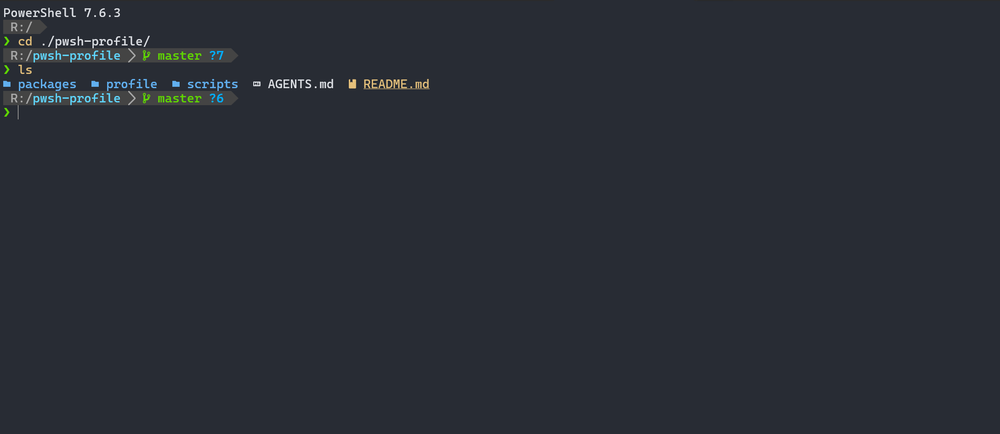

# PowerShell Profile

A fast personal PowerShell profile for Windows / PowerShell 7.

This repo keeps the profile portable without hiding missing dependencies. Modern CLI tools such as `lsd`, `bat`, and `rg` are explicit requirements; if they are not installed, the related commands should fail visibly.

See [Feature Reference](docs/FEATURES.md) for a detailed description of runtime behavior, key bindings, completion, background refresh, installation, and validation.

## What It Includes

- Two-line p10k classic-inspired prompt with gray Powerline segments.
- Smart path shortening with project-root awareness.
- Git prompt with a synchronous branch refresh after directory changes and branch-changing interactive Git commands, plus async dirty state, stash, conflict, and merge/rebase/cherry-pick/revert state.
- Git dirty-state probing remains asynchronous; the branch name appears immediately, while the status segment may redraw once its cache is ready.
- Git branch detection uses Git plumbing, so both files and reftable ref backends work.
- Right-aligned toolchain versions and command duration when the terminal is wide enough.
- PSReadLine history suggestions, prefix history search, and menu completion on the first Tab for interactive sessions.
- Zsh-style path completion: `/` only inserts a separator, Tab performs case-insensitive segment-prefix completion, directories end in `/`, and hidden entries require an explicit `.` prefix.
- Carapace external command completion, prewarmed on the first interactive idle, plus status-aware git path completion.
- `fnm` Node.js auto-switching with asynchronous interactive prewarming and on-demand fallback for `node`, `npm`, `npx`, `pnpm`, `yarn`, and `corepack`.
- Oh-my-zsh-style git aliases and directory navigation shortcuts.
- Unix muscle-memory helpers such as `which`, `whereis`, `touch`, `mkcd`, `head`, `tail`, `export`, `env`, `open`, `df`, `refreshenv`, and `reload`.
- Direct modern CLI wrappers:
  - `ls`, `l`, `ll`, `la`, `lt` use `lsd`.
  - `cat` uses `bat`.
  - `grep` uses `rg`.
- PowerShell's default `curl` / `wget` aliases are removed so real executables resolve from `PATH`.

## Project Structure

```text
profile/Microsoft.PowerShell_profile.ps1      entrypoint installed to $PROFILE.CurrentUserCurrentHost
profile/profile.d/10-prompt.ps1              prompt, async cache orchestration, background process helper
profile/profile.d/20-node.ps1                fnm asynchronous environment initialization and Node wrappers
profile/profile.d/25-icons.ps1               on-demand Terminal-Icons helper
profile/profile.d/30-psreadline.ps1          PSReadLine options, keybindings, duration tracking
profile/profile.d/40-completion.ps1          generic path routing, carapace cache, git path completion
profile/profile.d/50-aliases.ps1             lsd/bat/rg wrappers, git aliases, navigation helpers
profile/profile.d/60-utils.ps1               small Unix-style utility functions
profile/profile.d/prompt-updaters/*.ps1      async git/toolchain updater scripts
scripts/install.ps1                          install/sync local profile files
scripts/test-profile.ps1                     parser, policy, and startup benchmark checks
packages/winget.ps1                          optional dependency installer
```

## Prompt Layout

Wide terminals keep primary context on the left and auxiliary context on the right.



Markdown-native sketch, using broadly supported Unicode/ASCII characters instead of Nerd Font private-use glyphs:

```text
~/.../pwsh-profile/src › git main +2 !1 ?3 ⇡1 ≡1 ▶        ◀ node 20.12.2 │ py 3.12.4 │ 12.8s
❯
```

The real terminal prompt uses Nerd Font icons and Powerline separators. The screenshot above shows the intended rendering; the text sketch remains readable in Markdown viewers without Nerd Font support. The second-line symbol is green after success and red after failure.

Narrow terminals hide the right side first, so path and git state remain visible.

The default `classic` symbol set preserves the Nerd Font / Powerline appearance. For a plain-text current session, run:

```powershell
$script:LeanPromptSymbolSet = 'ascii'
```

ASCII mode also replaces the Node, Python, Go, Rust, and .NET icons with readable text. Run `Test-LeanPromptGlyphs` to inspect every symbol, Unicode codepoint, and terminal cell width; it does not inspect the active terminal font.

Git status symbols:

- `+N`: staged files
- `!N`: modified files
- `?N`: untracked files
- `xN`: deleted files
- `»N`: renamed files
- `⇡N` / `⇣N`: ahead / behind
- `≡N`: stash entries
- `✖N`: conflicts
- `rebasing`, `merging`, `cherry-picking`, `reverting`: active git operation

Ahead/behind counts are based on local refs. Run `git fetch` when you want `⇡N` / `⇣N` to reflect the remote's latest state.

If a full status scan exceeds three seconds, the worker retries without untracked-file discovery and remembers that slow working directory for five minutes. During this reduced scan, `?N` is omitted because the untracked count is unknown.

Command duration is shown only for slower commands:

- `< 2s`: hidden
- `2s - 9.9s`: gray
- `10s - 59.9s`: yellow
- `>= 60s`: red, formatted like `1m05s`

## Toolchain Segments

The right prompt shows project-local versions only when marker files are present:

- Node: `.node-version` or `.nvmrc`, using `fnm use --silent-if-unchanged` and `node -v`.
- Python: `.python-version`.
- Go: `go` directive in `go.mod`.
- Rust: `rust-toolchain.toml` or `rust-toolchain`.
- .NET: `sdk.version` in `global.json`.

Toolchain status is refreshed asynchronously and cached briefly, so prompt rendering does not block on version probes.

Interactive sessions also start `fnm env --json` in the background while the rest of the profile loads. Node command wrappers wait for that result on first use and retry initialization once if prewarming failed; non-interactive command and file sessions initialize only when a Node command is used.

## Completion And Editing

Interactive ConsoleHost sessions load PSReadLine with:

- Emacs edit mode.
- Inline history/plugin predictions.
- `UpArrow` / `DownArrow` prefix history search.
- `Tab` opening menu completion immediately.
- `Shift+Tab` opening menu completion directly (and moving backward inside an open menu).
- `Ctrl+C` during completion restoring the command line to its state before Tab and redrawing the prompt arrow in red; `^C` output is left to PSReadLine's native behavior.
- `Ctrl+C` outside completion clearing the current line and redrawing the prompt arrow in red.
- `Ctrl+W` deleting backward by PSReadLine word boundaries (`BackwardKillWord`).
- `Ctrl+RightArrow` accepting the next suggestion word.
- Command duration tracking for the prompt.

Path completion follows the Zsh `compinit` interaction model with Windows-friendly matcher behavior:

- The fast filesystem backend is selected from the current command AST, resolved aliases, and PowerShell parameter metadata rather than command-name special cases. Confirmed `Path`, `LiteralPath`, `Source`, `SourcePath`, `Destination`, and `DestinationPath` parameters share it; `Set-Location` and `Push-Location` path parameters are restricted to directories.
- Native commands use the fast backend only for explicit local paths such as `./`, `../`, `~/`, drive-qualified paths, and rooted paths. Bare native arguments remain with Carapace or the command's default completer.
- `/` is ordinary input and never starts completion; the first Tab opens the menu.
- Matching follows a Windows-friendly Zsh `matcher-list` style: each path segment uses a case-insensitive prefix. Substring matching and `-`/`_` interchange are intentionally not applied.
- Directories remain `ProviderContainer` candidates and end in `/`; file candidates advance with a trailing space. Quoted paths keep the suffix in the correct position.
- Dot-prefixed entries appear only when the current segment starts with `.`; Windows Hidden/System entries are omitted for an empty segment but remain available through an explicit prefix. Unique intermediate segments continue to the next level and ambiguous segments stop at that level.
- The fast backend supports `~`, `.`, `..`, drive roots, and local rooted paths. UNC paths, non-filesystem providers, wildcards, quoting, and complex expressions fall back to native completion instead of being guessed.
- Confirmed local filesystem results use their real on-disk case and are displayed with `/`; fallback completers retain their candidate set and command-specific filtering.
- A `/` inserted by directory completion has Zsh `AUTO_REMOVE_SLASH` behavior before another separator, Space, Enter, and command separators. Manually typed `/` is never treated as automatic.

Local filesystem enumeration checks for pending input while it runs. Ctrl+C cancels it silently, while another key stops completion and remains available to PSReadLine. A synchronous third-party completer cannot be forcibly unwound; if Ctrl+C arrives there, the saved command line is restored after that completer returns.

Carapace is prewarmed once on the first interactive idle and remains available with custom git path completion for commands such as `git add`, `git restore`, `git clean`, `git rm`, `git mv`, and `git commit`. Real-path results receive the same path rules; non-path results remain unchanged.

## Aliases And Helpers

Directory shortcuts:

```powershell
..      # cd ..
...     # cd ../..
....    # cd ../../..
```

Git aliases:

```powershell
g gst gss ga gaa gco gcb gb gc gcmsg gca gp gl gf gd gds glog gloga
```

Utility helpers:

```powershell
which whereis touch mkcd head tail export env open xdg-open df refreshenv reload icons
```

`icons` loads Terminal-Icons on demand. Normal directory listing uses `lsd --icon always`, so Terminal-Icons is not loaded during startup.

## Requirements

- PowerShell 7 (`pwsh`)
- Git
- lsd
- bat
- ripgrep (`rg`)
- fnm
- carapace

Optional:

- Terminal-Icons, only when manually running the `icons` helper.

`zoxide` and `fzf` are intentionally not required by this profile.

## Install

```powershell
git clone git@github.com:yi-ning-le/pwsh-profile.git
cd pwsh-profile
.\scripts\install.ps1
```

The installer validates and stages `profile/Microsoft.PowerShell_profile.ps1` plus every `.ps1` file under `profile/profile.d`, then replaces the installed entry and `profile.d` as a mirrored unit. Same-volume directory renames keep `profile.d` replacement atomic, so a locked target file fails the install without partially moving the existing tree. Stale target scripts are removed from the active install. Existing entry and `profile.d` trees receive separate timestamped backups; backups are retained until you remove them.

To skip permanent backups (rollback protection is still used during installation):

```powershell
.\scripts\install.ps1 -NoBackup
```

## Install Dependencies With winget

```powershell
.\packages\winget.ps1
```

The winget script installs Git, lsd, bat, ripgrep, fnm, and Carapace using exact package IDs. It stops at the first failed package and reports its ID and native exit code. Review the package list before running it on a new machine.

## Verify

```powershell
.\scripts\test-profile.ps1
# or increase the startup benchmark sample count
.\scripts\test-profile.ps1 -Runs 20
# run from a real, unredirected Windows Terminal to measure interactive features
.\scripts\test-profile.ps1 -InteractiveRuns 20
```

The test script checks parser errors, policy regressions, isolated runtime smoke cases, and a small startup benchmark. It recursively parses the entry profile and every `.ps1` file under `profile/profile.d`, then launches the repository source profile with `-NoProfile`; it does not benchmark a possibly stale installed copy. Git updater smoke cases cover the normal files backend and, when `git init -h` advertises `--ref-format`, a real reftable repository; Git versions without that option print an explicit reftable `SKIP`, while an advertised but failed reftable initialization fails validation. Startup results report both `MedianMs` and `AverageMs`, with the median used for comparisons. The default `BatchSourceProfile` metric excludes interactive-only features. `-InteractiveRuns` adds `InteractiveSourceProfile` and requires an unredirected ConsoleHost so PSReadLine, completion, Carapace, and prompt watchers actually load. Each interactive child has a 30-second safety timeout, and profile errors exit nonzero instead of leaving a `-NoExit` shell open. Any unexpected batch child-process output or nonzero exit fails the run.

## Runtime Cache

The profile writes local runtime cache under `$env:LOCALAPPDATA\PowerShell\ProfileCache`. This cache is machine-local and should not be committed.

Cached data includes async git status, async toolchain status, and generated Carapace completion script output. Git and toolchain cache files are published atomically from same-directory temporary files. Prompt updater scripts live in `profile/profile.d/prompt-updaters`; startup uses those source-controlled scripts directly instead of generating updater script files into the cache.

## Maintenance Policy

- Keep startup and prompt paths fast.
- Keep helper scripts readable; do not convert them to base64 blobs.
- Do not add fallback implementations for `lsd`, `bat`, or `rg` unless the owner explicitly changes this policy.
- Do not reintroduce `zoxide` or `fzf` unless they become actively used again.
